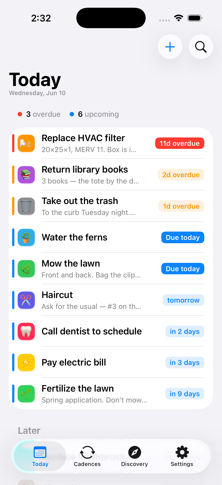
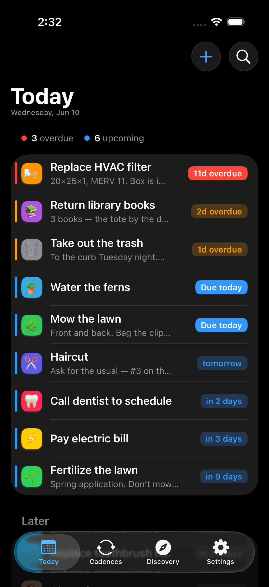

# Rhythm

**A self-populating to-do list for recurring life.**

Calendars fall out of sync the moment you skip a week. Plain to-do lists never re-add the task. Rhythm fixes both: recurring tasks regenerate themselves based on how they're *actually* scheduled, and only show up when they're genuinely worth your attention.

<p>
  
  
</p>

## How it works

| Concept | What it means |
|---|---|
| **Cadence** | A recurring task definition — "Mow the lawn, every week." Has a name, emoji, color, schedule type, frequency, and history. |
| **Beat** | One concrete occurrence of a cadence, with a due date. Completing or skipping it automatically generates the next one. Beats can also be standalone one-offs. |
| **Grace period** | How many days before its due date a beat starts mattering. Scales with frequency (weekly → 1 day, yearly → ~2 weeks). Drives list visibility, notification timing, and snooze length. |
| **Discovery** | For tasks where you don't know the frequency yet: log it a couple of times, Rhythm measures the interval and suggests one, then converts it into a real cadence. |

Two scheduling modes cover everything:

- **Relative** — the next beat counts from the day you *finish*. For things that drift: mowing, haircuts, watering plants.
- **Fixed** — the next beat counts from the previous *due date*, no matter when you got to it. For hard schedules: bills, trash day. Monthly and yearly intervals preserve their original anchor day (a bill due on the 31st clamps to Feb 28 but snaps back to Mar 31).

Beats escalate visually as they approach and pass due — a colored urgency bar and due chip move through *upcoming → due → overdue → late* — and the Today list keeps itself sorted by what needs you most. Snoozing pushes a beat off your radar until a date you pick (default: one grace period), notifications fire at the moments the grace model says matter, and the app icon badge always shows how many beats are due — even at midnight rollovers, thanks to pre-scheduled badge updates.

## Tech

- **SwiftUI** on iOS 26 — native components throughout; the only custom chrome is the urgency bar/chips and the toast pill
- **SwiftData mirrored to CloudKit** (private database) — full multi-device sync and restore with no server component
- **Local notifications** — a pure, unit-tested planner interleaves reminders and silent midnight badge updates within iOS's 64-pending-notification budget
- **Swift Testing** — the scheduling math, beat lifecycle, and notification planner are pinned by tests derived from the design spec

## Building

Requires Xcode 26.5+ and an iOS 26.5 simulator or device.

```bash
xcodebuild -project Rhythm/Rhythm.xcodeproj -scheme Rhythm \
  -destination 'platform=iOS Simulator,name=iPhone 17 Pro' build

# tests
xcodebuild -project Rhythm/Rhythm.xcodeproj -scheme Rhythm \
  -destination 'platform=iOS Simulator,name=iPhone 17 Pro' test -only-testing:RhythmTests
```

To run on your own device/account, change the development team and bundle identifier in Signing & Capabilities and point the iCloud capability at your own CloudKit container. DEBUG builds seed sample data into an empty store; release builds start empty.

## Repository layout

- `Rhythm/` — the Xcode project (app code, tests)
- `design_handoff_rhythm/` — the original design spec and runnable HTML/React prototype the app was built from
- `AGENTS.md` — architecture, domain invariants, and conventions (written for AI coding agents, useful for humans too)

## License

[CC BY-NC 4.0](LICENSE) — free to use, share, and adapt for non-commercial purposes with attribution.
